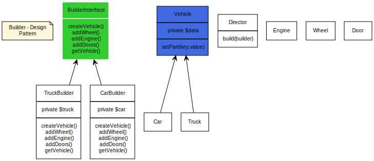

# Builder - Design Pattern

Builder یک interface است که اجزای یک شی پیچیده را خواهد ساخت.

بعضی وقت‌ها ، اگر builder دانش بهتری از آنچه خواهد ساخت را داشت این کلاس interface  می‌تواند جای خود را به یک کلاس abstract با متدهای از پیش تعریف شده بدهد. (aka adapter)

اگر یک درخت ارثی (inheritance tree) پیچیده برای اشیا دارید، منطقی است که یک درخت ارثی پیچیده هم برای builder خود داشته باشید.

_یاداداشت_ : Builder ها بعضا interface ساده‌ای دارندو mock builder از PHPUnit  را برای نمونه مشاهده کنید.

